# Guidance for generating recommendation of rules for AWS Entity Resolution

## Table of Contents

1. [Overview](#overview)
    - [Cost](#cost)
2. [Prerequisites](#prerequisites)
3. [Deployment Steps](#deployment-steps)
4. [Deployment Validation](#deployment-validation)
5. [Running the Guidance](#running-the-guidance)
6. [Next Steps](#next-steps)
7. [Cleanup](#cleanup)
8. [Notices](#notices)
9. [Authors](#authors)

## Overview

This Guidance provides an AWS Glue notebook that automates the generation of rule recommendations to more effectively match records using AWS Entity Resolution rule-based matching. The notebook reads input data from Amazon S3, analyzes its quality, and leverages a large language model (LLM) on Amazon Bedrock to produce tailored rule recommendations with accompanying reasoning. Additionally, the notebook applies a sampling approach to test the generated rules and resolve entities.

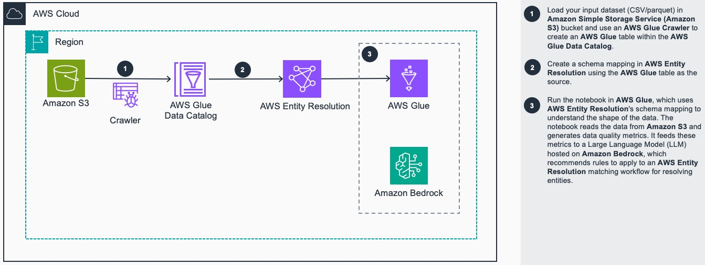

### Cost

_You are responsible for the cost of the AWS services used while running this Guidance. As of March 2025, the cost for running this Guidance with the default settings in the us-east-1 AWS Region is approximately $22.00 per month for running the AWS Glue notebook for 10 hours in a month consuming 5 DPUs._

_We recommend creating a [Budget](https://docs.aws.amazon.com/cost-management/latest/userguide/budgets-managing-costs.html) through [AWS Cost Explorer](https://aws.amazon.com/aws-cost-management/aws-cost-explorer/) to help manage costs. Prices are subject to change. For full details, refer to the pricing webpage for each AWS service used in this Guidance._

### Sample Cost Table

The following table provides a sample cost breakdown for deploying this Guidance with the default parameters in the US East (N. Virginia) Region for one month.

| AWS service  | Dimensions | Cost [USD] |
| ----------- | ------------ | ------------ |
| AWS Glue | 5 DPUs running for up to 10 hours per month  | $ 22.00month |

## Prerequisites

This deployment requires you to have the following resources enabled and available in your AWS account

**Resources:**
- Amazon S3 Bucket 
- AWS Entity Resolution
- AWS Glue
- Amazon Bedrock
- IAM role with specific permissions


**AWS Entity Resolution** - This guidance requires a schema mapping defined in AWS Entity Resolution. The AWS Entity Resolution schema mapping defines a connection between the source data stored in an Amazon S3 bucket and the AWS Entity Resolution service. This mapping allows the Entity Resolution service to access and process the input data, which can be in CSV or Parquet format. Before the schema mapping can be used, the data in the S3 bucket needs to be crawled and registered as an AWS Glue table. More information on how to create a schema mapping can be found [here](https://docs.aws.amazon.com/entityresolution/latest/userguide/schema-mapping.html).


**Anthropic Claude 3.5 Sonnet v2** - This guidance uses a large language model (LLM) hosted on Amazon Bedrock. This guidance has been prepared using Anthropic's Claude 3.5 Sonnet v2 model, which is generally available on Amazon Bedrock. However, you have the flexibility to use any other LLM model that is available on Amazon Bedrock. Refer to the provided [link](https://docs.aws.amazon.com/bedrock/latest/userguide/model-access-modify.html) to enable access to the LLM model of your choice.

## Deployment Steps

1. Clone the repo using command ```git clone https://github.com/aws-solutions-library-samples/guidance-for-generating-recommendation-of-rules-for-aws-entity-resolution.git```
2. Launch the AWS Console in a browser and navigate to [Amazon CloudFormation](https://us-east-1.console.aws.amazon.com/cloudformation/home)
3. Select `Create Stack` with new resources option
4. Upload the CloudFormation yml file available in the `deployment` folder in the repo

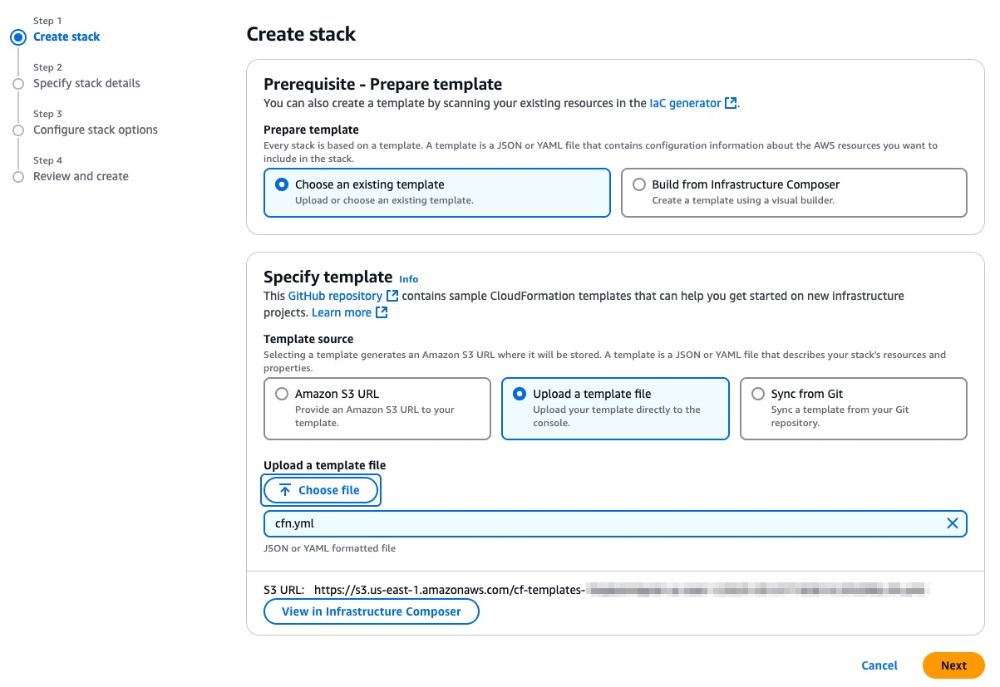

5. Proceed through the stack creation process and deploy the stack. This will create an IAM role starting with `RuleRecommendationNotebookIAMRole-`. This role will be used in the AWS Glue notebook creation process.

6. Import the notebook within AWS Glue
   - Navigate to [AWS Glue](https://us-east-1.console.aws.amazon.com/glue/home) in the AWS Console
   - Select `Notebooks` in the left navigation bar
   - Select `Notebook` option in **Create job** section
   - Select `Upload Notebook` and choose the `source/genai-based-rules-entity-resolution.ipynb` notebook from the repository. Also select the **IAM role** created above in Step 5.

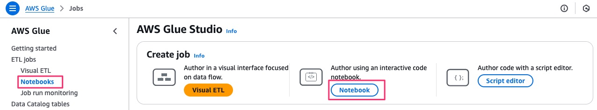

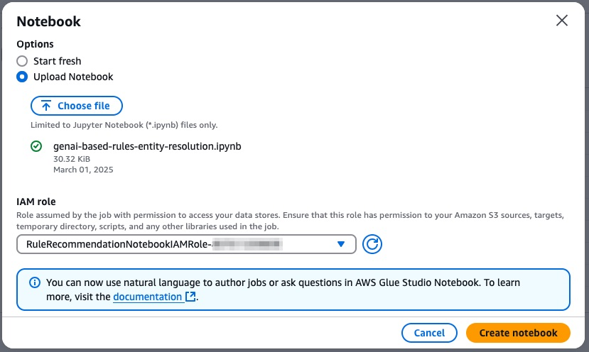
 
7. Click `Create notebook` to create the resource
8. Once the notebook is imported, it will take a few minutes to load
9. Once the notebook is loaded, give it a meaningful name, and click on `Save`
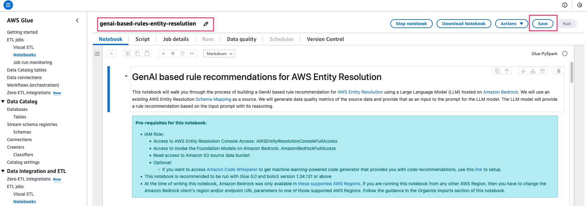

## Deployment Validation

* Open [CloudFormation console](https://us-east-1.console.aws.amazon.com/cloudformation/home) and verify the status of the stack is completed successfully with the NotebookIAMRole created starting with `RuleRecommendationNotebookIAMRole-`.
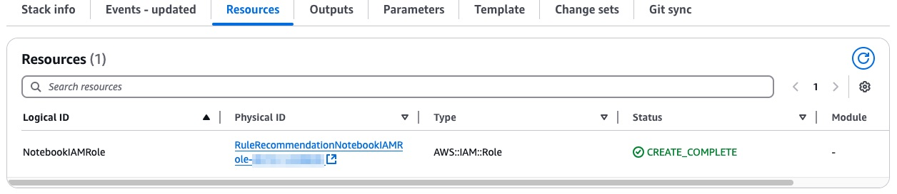


* If notebook has been imported and saved successfully, you should see the notebook listed in the [AWS Glue Console](https://us-east-1.console.aws.amazon.com/gluestudio/home)
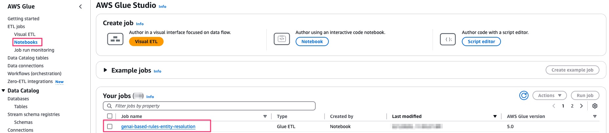


## Running the Guidance

* Navigate to [AWS Glue](https://us-east-1.console.aws.amazon.com/glue/home) and launch the notebook. It may take a few minutes as the notebook starts
* Once the notebook has started, update the content in **Section 2.a** with details of your AWS Entity Resolution schema mapping name, and the source AWS Glue table.

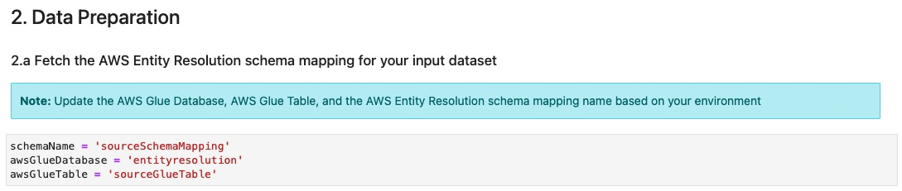


* Update the content in **Section 4.a** with the details of Claude 3.5 Sonnet v2 model id. Replace the `region` and the `AWSAccountNumber`.

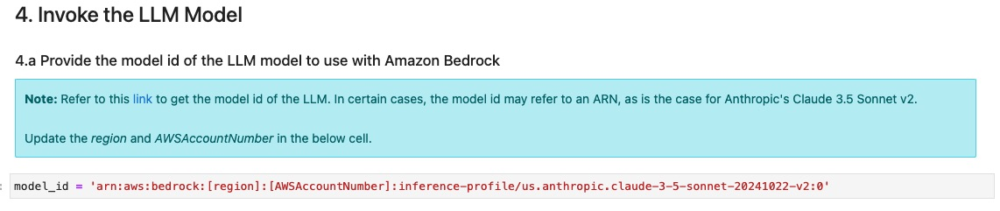


* Run all the cells of the notebook
* **Section 4** of the notebook describes the output in multiple stages:
  * A LLM prompt response generates the recommended rule along with its reasoning, based on the source data and its quality
   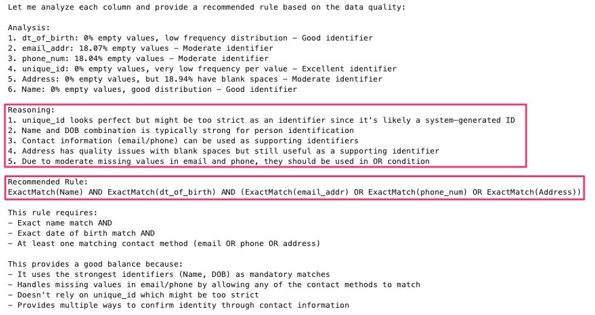
  * The subsequent cells of the notebook extract the rule from the LLM output and applies it to a *sample* set of records to validate the rule. The below image demnostrates which record pairs match based on the rule.
  
    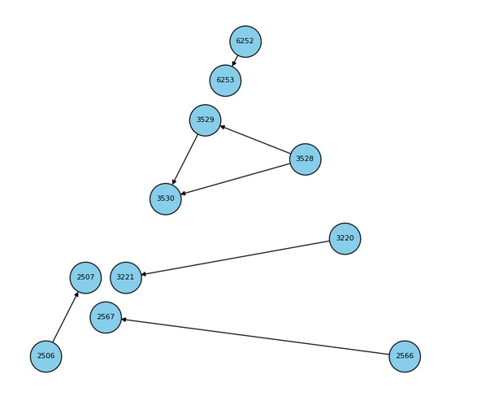


## Next Steps

- You may tweak the LLM prompt in **Section 4.b** based on your use case to fine tune it. 
- This notebook uses the Anthropic Claude 3.5 Sonnet v2 model, but you may try different models available in Amazon Bedrock.


## Cleanup

- Stop the notebook after you have completed the run.
- In order to delete all resources associated with this guidance:
  - delete the AWS Glue Notebook from the console
  - delete the CloudFormation stack


## Notices

*Customers are responsible for making their own independent assessment of the information in this Guidance. This Guidance: (a) is for informational purposes only, (b) represents AWS current product offerings and practices, which are subject to change without notice, and (c) does not create any commitments or assurances from AWS and its affiliates, suppliers or licensors. AWS products or services are provided “as is” without warranties, representations, or conditions of any kind, whether express or implied. AWS responsibilities and liabilities to its customers are controlled by AWS agreements, and this Guidance is not part of, nor does it modify, any agreement between AWS and its customers.*

## Authors

Punit Shah